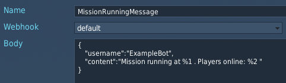

[Back](../Readme.md)
# Mission Scripting Commands

## Send
`Webhooker.send` is the main method to call from your mission scripts to queue sending a webhook request from one of your configured templates.

### Specification

```
Webhooker.send(<template name>,<positional param 1>,<positional param 2>, ...)
```
Where:

* `<template name>` - string identifying the template. as seen in the config pages here:


* `<positional param N>` - handle of a string to replace `%N ` () in the template request body. Must be returned by one of the messages in the [section](#positional-argument-methods) below.

### Example
```
Webhooker.send("MissionRunningMessage", Webhooker.func("datetime"),Webhooker.func("list",Webhooker.string(", "),Webhooker.player("Player1"),Webhooker.player("Player2")))
```


Resulting Discord message:
```
Mission running at 13/11/2023 09:00:00. Players online: Player1, Player2
```
## Positional argument methods

### Webhooker.func
`Webhooker.func` creates a positional template parameter for `Webhooker.send` (or another `Webhooker.func`) by calling a function defined in the messageTemplates folder.

Usage:
```
Webhooker.func(<func name>, <func arg 1>, <func arg 2>)
```
Where:

* `<func name>` - string identifying the function. For built in functions see this [section](#default-functions).
* `<func arg N>` - integer, or handle of a string returned by one of the positional argument methods (`func`, `player`, `string`).


#### Default functions
By default `Webhooker.func` includes options:
Name        | Description                                   | Example                                                                                          | Result
-----       |-------------                                  |----------                                                                                        |-------------
datetime    | Format date time                              | `Webhooker.func("datetime")`                                                                     | "31/01/2023"
int         | Format integer                                | `Webhooker.func("int",7)`                                                                        | "7"
list        | Concatenate string parameters                 | `Webhooker.func("list",Webhooker.string(", "),Webhooker.func("int",1), Webhooker.func("int",2))` | "1, 2"
playerCount | Number of players connected. Optionally filtered by side.                  | `Webhooker.func("playerCount",coalition.side.RED)`, or `Webhooker.func("playerCount")`                                                                  | "3"
playerList  | List names of all players connected now. Optionally filtered by side.        | `Webhooker.func("playerList",coalition.side.BLUE)`, or  `Webhooker.func("playerList")`                                                               | "user0012, PlaneDude6 and fred"


### Webhooker.player
`Webhooker.player` convert a player name (or names) to a positional template parameter in `Webhooker.send` (or `Webhooker.func`)

Usage:
```
Webhooker.player(<player name>)
```
Or
```
Webhooker.player(<player name table>)
```
Where:

* `<player name>` - display name of a player in the server.
* `<player name table>` - table containing a list of names to unpack as parameters

Examples:
```
Webhooker.player(unit:getPlayerName())
```
```
Webhooker.func("list",Webhooker.string(", "),Webhooker.player({unit1:getPlayerName(),unit2:getPlayerName()}))
```

### Webhooker.string
`Webhooker.string` specify one of the configured strings at positional template parameter in `Webhooker.send` (or `Webhooker.func`)

Usage:
```
Webhooker.string(<string key>)
```
Where:

* `<string key>` - key of a pre-configured string, as set in the configuration:


Example:
```
Webhooker.string("MyString")
```