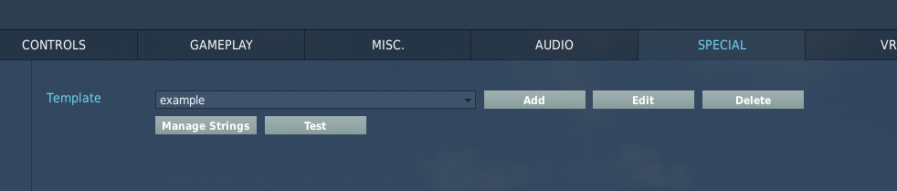
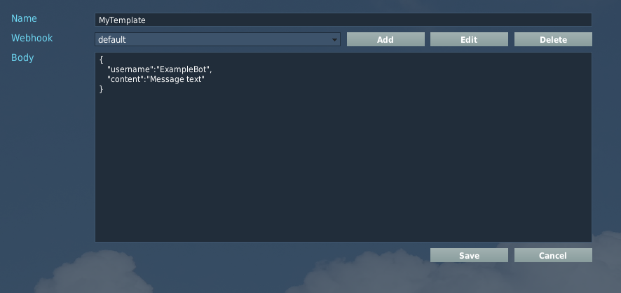
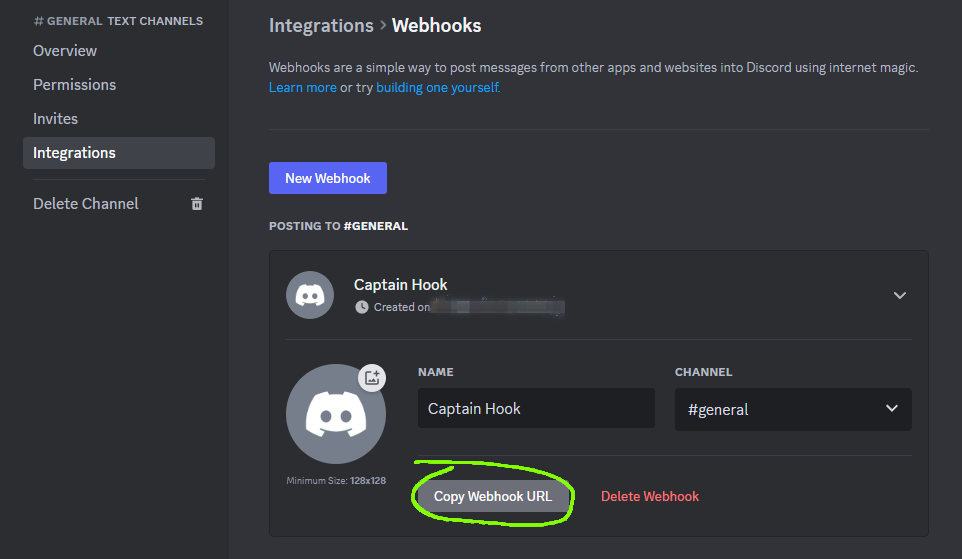
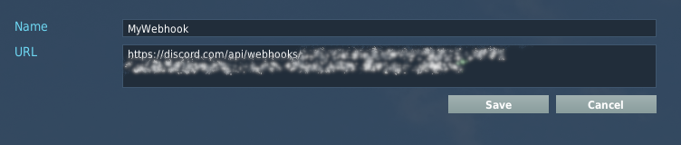
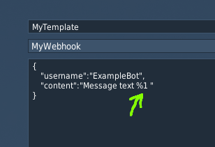
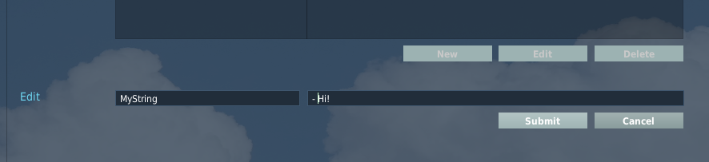
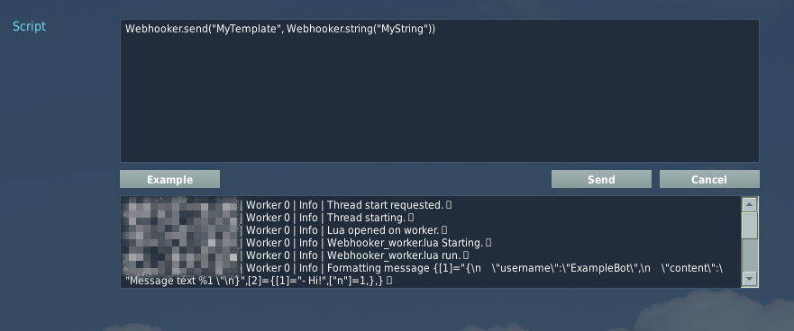
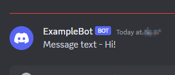

[Back](../Readme.md)
# Server configuration menu walkthrough

## Template list

From this page you can:
* Select a template to edit or delete
* Add a new template and start editing
* Navigate to other pages for string management and testing

## Add new template
Clicking "Add" from the template list creates request with empty body, or optionally pre-populates a Discord-style webhook body.


## Third party webhook setup
To create the recipient webhook and obtain the URL to use for your requests, consult your third party service documentation. For example on Discord, webhooks can be added to a channel from the page shown here:


## Edit webhook
Enter your webhook URL in the Add/Edit webhook form, and choose a name.


## Create webhook body
Add placeholders to your template webhook body. These will be substituted when the request is sent. 

Syntax:
```
%<N>%
```
Or
```
%<N><space>
```
Where
* `<N>` - the index of the positional argument to substitute here (for the first argument, use `%1 `).
* `<space>` - any whitespace character or the end of the string. This terminating character is **not** included in the output.

Example:
```
Hello %1%. This is a test message.
```


## Manage options for Webhooker.string
Use the **Manage Strings** page to add, edit or delete strings to substitute in your templates.


## Test a mission script fragment
Use the **Test** page to prepare Webhooker commands for *DO SCRIPT* triggers, or to include in your mission script files.

Notes:
* Click **Example** to generate a command with random positional parameters for the currently selected template. 
* Webhooker.func calls result in output like "\<funcname result\>" instead of actually evaluating the function
* Log file lines are displayed on this page to help diagnose problems with your template (or bugs in Webhooker!)

